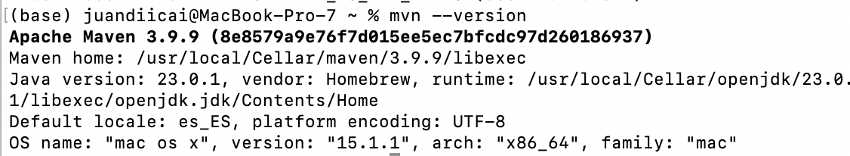

# Práctica 1

Explicación sobre el funcionamiento de distintos comandos de Git e instalación de Java, Maven y VsCode + Intellij.

## GIT CLONE

Creamos una copia completa del repositorio en local.

## GIT STATUS 

Indica el estado del repositorio local y la rama en la que estamos trabajando

## GIT ADD 

Se preparan archivos para ser incluidos en el próximo commit

## GIT COMMIT

Confirma los cambios añadidos con git add

## GIT PUSH

Sincronizas los cambios locales con la versión remota

## GIT CHECKOUT -B FEATURE/1

Crea una nueva rama llamada feature/1 y cambia a esta

## GIT CHECKOUT MAIN

Vuelve a cambiar a la rama main

## INSTALACIÓN JAVA 17

## INSTALACIÓN MAVEN

## INSTALACIÓN VSCODE + INTELLIJ

